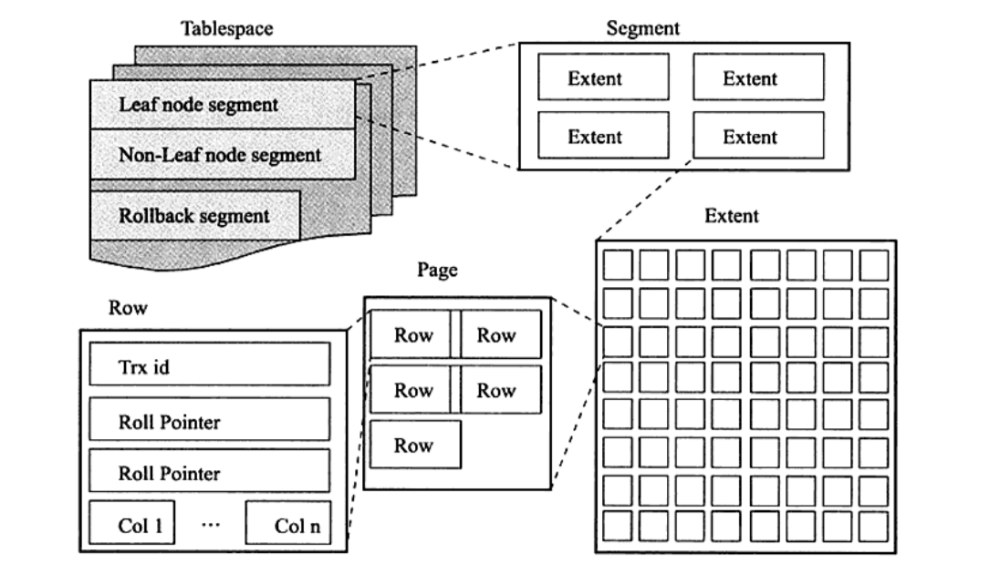

# MySQL技术内幕_InnoDB存储引擎

# 基本概念

**数据库**: 物理操作系统文件或其他形式文件类型的集合,依照某种数据模型组织起来存放于二级存储器的中的数据集合 

**数据库实例**:用于管理数据库文件  ,是程序,他位于用户和操作系统之间的一层软件,用户对数据库的任何操作都是通过实例来完成的

**mysql是单进程,多线程**

## MYSQL体系结构

- 连接池
- 管理服务和工具组件
- SQL接口组件
- 查询分析器组件
- 优化器组件
- 缓冲组件
- 插件式存储引擎
- 物理文件

**存储引擎是基于表的,并且是底层物理结构的实现**

## InnoDB存储引擎

支持行锁,外键,非锁定读(默认读取操作不会产生锁)

他将数据放在一个逻辑的表空间中,并且可以将表单独放到一个独立的idb文件中

他通过多版本并发控制(MVCC)来获得高并发性,并且实现了SQL标准的4中隔离级别,默认是REPEATABLE级别.他使用`next-keylocking`来避免幻读(phantom);他还提供了插入缓冲,二次写,自适应哈希索引,预读等高性能和高可用功能

对于表中的存储的数据,InnoDB采用了聚集(clustered)的方式,因此每张表存储的数据都是按照主键进行存放,如没有没有主键,存储引擎会为每一行自动计算出一个6字节的ROWID,并以此作为主键

## MyISAM存储引擎

不支持事务,表锁;但是支持全文索引.

他的一个特点是,缓冲池值缓存索引文件,而不索引数据文件

表由MYD和MYI组成,MYD用于存放数据,MYI用于存放索引文件

可以使用myisampack来压缩数据文件(使用赫夫曼编码静态算法),**并且压缩后的表是只读的**,也可以通过myisampack也解压缩

## NDB存储引擎

数据全部放在内存中

## Memory存储引擎

表中的数据放在内存中,数据库重启或发生崩溃数据就丢失.

他默认使用hash索引,而不是B+索引.

只支持表锁,并发性能较差,不支持text和blob类型

## Archive存储引擎

只支持insert和select.它使用zlib算法对数据行进行压缩后存储

他使用行锁来实现高并发的插入操作 

## Maria存储引擎

用于替代MyISAM

支持缓存数据和索引(MyISAM只缓存索引),实现了行锁,提供了MVCC功能,支持事务和非

## 连接MySQL

连接mysql是一个连接进程与mysql数据库实例进行通信.本质上是进程间通信,进程间通信方式有:管道、命名管道，命名字、TCP/IP、Unix域套接字,mysql本质上就是通过上面这些进程间方式通信.

### TCP/IP

当通过TCP/IP连接到mysql实例时,mysql会先检测一张权限图,用来判断发起请求的客户端ip是否允许连接到mysql实例,就是从`mysql.user`表进行判别

### 命名管道和共享内存

命名管道需要在配置中启用`--enable-named-pipe`选项;

共享内存需要使用`--shared-memory`

### Unix域套接字

配置套接字文件路径`--socket=/tmp/mysql.sock`

# InnoDB 存储引擎

## 概述

特点:行锁、支持MVCC、外键、一致性非锁定读  
- `1.0.x`增加了compress和dynamic页格式  
- `1.1.x`增加了LinuxAIO、多回滚段  
- `1.2.x`增加了全文索引、在线索引添加通能  

## InnoDB体系架构

有后台线程、内存块、磁盘文件组成

InnoDB存储引擎有多个内存块,他们组成了一个大的内存池,用于负责一下功能:
- 维护所有进程/线程需要访问的多个内部数据结构
- 缓存磁盘上的数据,方便快速读取,同时在对磁盘文件修改之前在这里缓存
- 重做日志缓冲
- ....

### 后台线程

mysql是多线程模型,不通线程负责处理不通的任务

#### **Master Thread**

是后台的核心线程;负责:
- 将缓冲池的数据异步刷新到磁盘
- 保证数据的一致性:包括脏页的刷新,合并插入缓冲(Insert buffer),UNDO页的回收等
#### **IO Thread**

InnoDB大量使用了AIO(异步IO)来处理写IO请求,来提高数据库性能.

IO线程主要赋值IO请求的回调处理;

老版本总共有4个io线程:write,read,insert buffer,log 

目前:write和read分别增加到了4个线程;可以通过`innodb_read_io_threads`和`innodb_write_io_threads`参数设置

`show engine innodb status\G;`查看线程状态

#### Purge Thread

事务提交后,其使用的undolog可能不在需要,因此需要回收已经使用并分配的undo页

老版本是在Master线程中回收,现在可以用过`innodb_purge_threads=1`来启用purge多个线程来专门回收undo页,以提高性能

#### Page cleaner Thread

1.2.x新增目的是将脏页的刷新放到单独的线程中来完成,以减轻Master工作和对用户查询线程的阻塞;进一步提高InnoDB性能

### 内存

#### 缓冲池

InnoDB基于磁盘存储,并将记录按照页的方式进行管理

对数据进行读取页操作时,首先加载页到缓冲池中(也叫FIX到缓冲池),在此读取页时,会首先检查缓冲池,有就命中

如果要修改数据库中的页,首先修改的是缓冲池中的页,然后以一定频率刷新到磁盘上

刷新频率通过`Checkpoint`机制

缓冲池配置通过`innodb_buffer_pool_size`来设置

缓冲池缓存的数据类型有:索引页,数据页,undo页,插入缓冲(insert buffer),自适应哈希索引(adaptive hash index),InnoDB存储的锁信息(lock info),数据字典信息(data dictionary)等

1.0 之后允许有多个缓冲池实例,每个页根据hash值平均分配到不通的缓冲池实例中,来减少数据库内部的资源竞争,增加并发能力:`innodb_buffer_pool_instances=2`设置两个实例

####  LRU list、Free list、Flush list

innodb通过LRU(latest recent used 最近最少使用)算法来管理缓冲池

LRU前端放最频繁使用的数据,后端放最少使用的,缓冲池不能存放更多是,就释放后面的页

默认页的大小时16KB,InnoDB对LRU进行了优化,新的页数据不会直接放到头部,而是放到中间,中间后面的数据叫做old列表,之前的成为new列表

> 如果直接把新读取的页直接放到,LRU头部,那么可能会导致缓冲池中数据被刷出,从而影响到缓冲池效率,或者新都的页数据可能使用频率很小,那么放到头部效率就会低;还可以设置mid位置的业数据等待多久后才能添加到LRU的前段:`innodb_old_blocks_time=100;innodb_old_blocks_pct=20`

数据库刚启动时,LRU为列表时空的,此时页都放在Free列表中,当需要从缓冲池中分页时,首先从Free中查找可用的页,如果有就从Free列表中删除,加入到LRU列表中,找不到就根据LRU算法淘汰末尾的页.

页从old转到new操作为page made young

缓冲池中的哈希索引,lock信息等页时不需要LRU维护的

如果缓冲池的页被修改了,那么称为脏页.数据库会通过checkpoint将脏页刷新到磁盘,**flush列表的中的页就是脏页列表**.**脏页及存在于LRU中也存在与flush中,他们互不影响**

#### 重做日志缓冲

一般每秒都会把重做日志刷新到磁盘上,所以只要保证每秒产生的事务量在这个缓冲大小之内就行,`innodb_log_buffer_size`来控制大小字节单位,一般8MB可以满足绝大部分应用;以下情况会触发刷新操作:
- Master线程每一秒将重做日志刷新到重做日志文件
- 每个事务提交时会将重做日志刷新到重做日志文件
- 当重做缓冲池剩余空间小于1/2时,会将重做日志刷新到重做日志文件

#### 额外的缓冲池

堆内存的管理是通过一种内存堆(heap)的方式进行管理

在对一些数据结构本身的内存进行分配时,需要从额外的内存池中进行申请,当该区域的内存不够时,会从缓冲池中进行申请,除了缓冲池,还有缓冲池对象本身,例如:LRU,锁,等待等信息所以当申请很大的缓冲池时,也应当增大额外的内存池

## CheckPoint技术

缓冲池就是为了解决CPU和磁盘速度的鸿沟.当缓冲池数据被修改后,什么情况下刷新到磁盘

每一页发生变化就刷新,开销会很大

对于事务,我了避免数据丢失,事务提交时都是先写重做日志,再修改页.

有几个问题:
- 重做日志如果很大,那么每次回复数据库需要大量时间
- 缓冲池不可能无限大,所以要在适当的时候把脏页刷新到数据库中

checkpoint主要解决一下几个问题:
- 缩短数据库的恢复时间
- 缓冲池不够用时,将脏页刷新到磁盘
- 重做日志不可用时,刷新脏页
  
当数据库发生宕机时,不需要重做所有的日志,因为checkpoint之前的页都已经刷新回磁盘,所以只需对checkpoint之后的重做日志进行恢复,

对于LRU算法溢出的页需要立即强制执行checkpoint,因为脏页需要刷回磁盘

重做日志:InnoDB中通过使用LSN(log sequence number)来标记版本的,lsn是8字节的数字,其单位是字节;每页有lsn,重做日志有lsn,checkpoint也有lsn

checkpoint的任务就是将脏页刷新到磁盘,但是每次刷新多少,每次从哪里去脏页,以及什么时间出发checkpoint.有两种checkpoint:
- sharp checkpoint
- fuzzy checkpoint

**Sharp**

在数据库关闭时将所有的脏页刷新到磁盘,这是默认的方式,参数是`innodb_fast_shutdown=1`

在数据库运行时页使用sharp方式,会导致数据库可用性变低;而 **fuzzy**方式只刷新一部分脏页回磁盘

有一下几种情况会导致出发fuzzy方式:
- master线程会每秒或每十秒执行一次刷新脏页操作
- LRU列表要保证至少有100个可用空闲也,如果LRU尾部的被移除的页是脏页那么页出发刷新;可以通过`innodb_lru_scan_depth`来控制可用页数量
- 重做日志不可用的情况,
- Page Cleaner线程
- dirty page too much脏页数目太多,可以通过`innodb_max_dirty_pages_pct`控制

## Master线程工作方式

### 1.0之前

master具有最高优先级,内部由多个循环组成:主循环、后台循环、刷新循环、暂停循环，master的运行转台在：loop，background loop、flush loop、suspend loop中切换

master会每秒执行一次操作，包括：
- **日志缓冲刷新到磁盘，即使这个事务还没有提交（总是）**
- 合并插入缓冲（可能）
- 之多刷新100个脏页（可能）
- 如果当前没有用户活动，就切换到background loop（可能）

即使某个事务没有提交,InnoDB存储引擎任然每秒会将重做日志缓冲中的内容刷新到重做日志文件,所以再大的事务提交的时间也是很短的

合并插入缓冲(insert buffer)不是每秒都会发生,innodb会判断前一秒内发生的io是否小于5次,如果小于5次,就认为io压力很小,就执行合并插入缓冲的操作

刷新100个脏页也不是每秒都会发生,innodb会判断当前的缓冲池脏页的比例(`buf_get_modified_ratio_pct`)是否超过了配置(`dirty_pages_pct`默认是90,90%),如果超过,innodb认为需要做磁盘的同步操作

### 1.2之前

之前的版本对IO限制有点大,ssd的出现使得一次100个脏页以及20个插入缓冲有点跟不上.因为写入密集型的应用,每秒可能差生大于100个脏页,并且产生大于20个插入缓冲的情况,master线程必然会忙不过来

### 1.2之后

把脏页刷新的操作放到独立线程page cleaner中,这样降低了master压力,提高了并发

## InnoDB关键特性
- 插入缓冲
- 两次写(double write)
- 自适应哈希索引(adaptive hash index)
- 异步IO
- 舒心邻接页(flush neighbor page)

### 插入缓冲

### 两次写

### 自适应哈希索引

哈希索引极快,一般是O(1).B+树的查找次数,取决于高度.

innodb会监控表上个索引页的查询,如果发现使用hash索引可能更快,那么就会简历哈希索引,这就是自适应哈希索引

### 异步IO

AIO的一个优势是可以进行IO merge操作,将多个io合并为一个IO

### 刷新邻接页

当刷新一个脏页时,innodb会检查该页所在区的所有页,如果是脏页就一起刷新,同时aio可以将他们合并为一个io

## 启动、关闭、恢复

innodb的启动关闭，就是mysql实例启动过程中对innodb的处理过程

innodb_fast_shutdown参数:
- 0 表示完成所有的full purge、merge insert buff，并且将所有的脏页刷新到磁盘，这比较耗时，在升级时，需要使用0
- 1 默认值，不需要完成full purge和merge insert buffer，但是会刷新所有脏页
- 2 只写入日志不刷新脏页，这样事务不会丢失，下次启动mysql时，会进行recovery

# 文件

## 参数文件

mysql参数文件以文件形式存储

参数是key=value形式 

**参数类型**:
- 动态参数:可以在运行时进行修改
- 静态参数:不可修改,只读

## 日志文件

常见日志:
- 错误日志
- 二进制日志
- 慢查询日志
- 查询日志

### 错误日志
记录mysql启动、运行、关闭过程。

### 慢查询日志

慢查询可以定位到存在问题的SQL语句,从而进行SQL语句层面的优化.可以在mysql启动时设置一个阈值,超过改制就会记录到慢查询中日志中

通过`long_query_time`来设置,默认10,单位是秒

还有一个参数`log_queries_not_using_indexes`,打开这个参数,那么只要查询语句没有使用到索引,那么就会记录到慢查询日志中

假如,为使用索引查询的语句很多,那么就会记录很多这样的日志,可以设置`log_throttle_queries_not_using_indexes`来设置,每分钟达到多少条未使用索引的语句才会记录.0表示不限制

通过`mysqldumpslow`可以查看慢查询日志

### 查询日志

记录了所有对mysql数据库请求的信息,无论这些骑牛是否得到了正确的执行,默认名为:`主机名.log`

### 二进制日志

记录了对mysql数据库执行更改的所有操作,如果执行的语句没有修改数据中数据,那额是不会记录的

包括以下几种作用:
- 恢复
- 复制: 通过复制和执行二进制日志让一台远程mysql服务器进行实时同步
- 审计: 对二进制日志审计,看是否有注入攻击

默认是没有启用的,需要手动启用.对系统新能会有一点损耗,但是很小;

其他参数:

`max_binlog_size`: 单个二进制日志文件最大值,超过就产生新的,后缀名+1,记录到`binlog.index`中 默认1G大小

当使用事务时所有未提交的二进制日志会被记录到一个缓存中区,等待该事务提交后,直接将缓存中的二进制日志写到二进制日志文件,缓存大小`binlog_cache_size`决定默认32K,此外这个缓存是针对session的,当一个线程开始一个事务时,mysql会自动分配一个缓存,所以不能太大,也不能他笑

二进制日志也是先写到缓存再同步到磁盘,通过`sync_binlog=[N]`来设置没写缓存到少次就同步到磁盘,如果是1,那么就是直接通过磁盘,不会通过缓存;当直接写磁盘时,如果事务开启但是并没有commit,这使得二进制日志已经记录了信息,但是如果在commit之前宕机了,那么久无法回滚了.`innodb_support_xa=1来保证二进制日志和innodb存储引擎数据文件的同步

`binlog-do-db`和`binlog-ignore-db`表写记录和忽略哪些数据库的日志,默认为空,就是全部记录;如果是主从复制的话,那么从数据库不会把主数据库同步的二进制日志写入自己的日志中;如果是master->slave->slave的复制,就必须设置该参数

`binlog_format`日志格式

## 套接字

unix域套接字;`show variables like 'socket'\G;`

## pid 文件

`show variables like 'pid_file'\G;`

## 表结构文件

所有表都有`.frm`的文本文件与之对应,文件记录了标的结构定义了,每个视图也有这个文件.

## 存储引擎文件

### 表空间文件

innodb将存储的数据按表空间进行存放.默认配置下会有一个初始大小为10MB,名为ibdata1的文件,他就是默认表空间文件,可以通过`innodb_data_file_path`进行配置

例如:`innodb_data_file_path = /db/ibdata1:2000M;/dr2/db/ibdata2:2000M:autoextend`

这里表示用`/db/ibdata1`和`/dr2/db/ibdata2`两个文件来组成表空间.如果两个文件在不通的磁盘上,磁盘的负载可能被平均,因此可以提高数据库的性能;每一个文件都设置了大小,另外第二个文件可自动增长

所有基于innodb存储引擎的数据都会记录到该共享表空间中.如果设置了`innodb_file_per_table`可以每个表产生独立的表空间,表空间文件的命名规则是`表明.ibd`

### 重做日志文件

默认情况下,innodb数据目录下有两个日志文件`ib_logfile0`和`ib_logfile1`,这两个就是重做日志,他记录了事务的日志

每个innodb引擎至少有一个重做日志组,每组至少有连个重做日志,一般会设置多个日志组,并且放在不同磁盘上;每个重做日志大小一致,并以循环写入方式运行;重做日志1写满后会写入2中,2满了后会在写入1中

几个参数:
- `innodb_log_file_size`: 日志大小不能超过512G
- `innodb_log_files_in_group`: 每组几个文件,默认2
- `innodb_mirrored_log_groups`: 日志镜像文件组的数量,默认1,表示只有一个日志文件组,没有镜像
- `innodb_log_group_home_dir`: 日志文件组所在目录 默认 './' 数据目录下

与二进制日志的区别:重做日志只记录有关该存储引擎本身的事务日志,并且记录的是每个页的更改的物理情况

二进制日志仅在事务提交时写磁盘一次,无论事务有多大;而事务过程中,不断的有重做日志写入文件中

# 表

## 索引组织表

innodb中表示按照主键顺序组织存放的,这种方式成为 **索引组织表**;

每张表都有一个主键;如果没有显示声明,那么通过以下方式选择或创建主键:
- 首先判断表中是否有费控的唯一索引(unique, not null),如果有,就把第一找到的作为为主键,这里是按照定义索引的顺序,而不是按照列的顺序
- 如果找不到,就自动创建6字节大小的指针

## 逻辑存储结构

所有数据都存放表空间中,表空间由:段(segment)、区（extent）、页（page）组成，页有时候也叫块（block）

`段<区<页<行`

### 表空间

默认数据是放在共享表空间`ibdata1`中,也可以给每张表一个空间,但是每张表的空间存放的是 **数据,索引,插入缓冲bitmap页**,其他数据,如:回滚(undo)信息、插入缓冲索引页、系统事务，二次写缓冲等还是放在共享表空间

### 段

常见段:数据段,索引段,回滚段等.

innodb表示索引组织的,因此数据就是索引,数据就是B+树的叶子节点,而索引段就是B+树的非索引节点.

段有引擎自动管理,无法认为干预

### 区
区由连续页组成,每个区固定大小为1MB,默认每个页的大小为16KB,就是说一个区默认有64个连续页.innodb通常一次从磁盘申请4~5个区,从而保证页的连续性

页支持压缩,是每个页压缩后的大小可以设置为`KEY_BLOCK_SIZE`为2K,4K,8K,从而每个区可以有512,256,128个页

同样也可以直接设置也得大小,可以为4K,8K,但是不是压缩的也大小

### 页

通过`innodb_page_size`可以设置页的大小可以为:4K,8K,16K

常见页:
- 数据页(B-tree Node)
- undo 页(undo log page)
- 系统也(system page)
- 事务数据页(transaction system page)
- 插入缓冲位图页(insert buffer bitmap)
- 插入缓冲空闲页(insert buffer free list)
- 未压缩的二进制大对象页(UNcompressed blob page)
- 压缩的二进制大对象页(compressed blob page)

### 行

innodb是面向列的`row-oriented`也就是数据是按行存放的(也有的数据库是按照列存放的`column-oriented`)

每页最允许存放 16KB/2-200行的记录,即7992行记录;

## 行记录格式

innodb有两种格式来存放行记录数据:Compact和Redundant,默认是compact.redundant是为了兼容老版本

### compact行记录格式

页中存放的行数据越多,他的性能就越高.compact存储方式:
`[变长字段长度列表|null标志位|记录头信息|列1数据|列2数据|....]`

行记录首部是一个非NULL变长字段长度列表,并且是按照列的顺序逆序放置的,长度为:
- 若列长度小于255字节,用1字节表示
- 大于就用2字节表示

变长字段长度不可超过2字节,varchar长度不超过65535

null标志位,指示行数据中是否有null值,有则用1表示,该部分占用1字节 00000110表示第2,3列是NULL

记录头信息固定占用5字节,每位含义:

- 1 未知
- 1 未知
- 1 `deleted_flag` 该行是否已被删除
- 1 `min_rec_flag` 如果该记录是预先定义为最小的记录,这个字节的值为1
- 4 `n_owned`该记录拥有的记录数
- 13 `heap_no`索引堆中该记录的排序记录
- 3 `record_type`记录类型:000表示普通,001表示B+树的节点指针,010表示Infinum,011表示Supremum,1xx表示保留
- 16 `next_record`页中下一条记录的相对位置

最后就是每列存储的数据,**NULL不会占用该部分任何空间**,即NULL只占用NULL标志位,实际不占用任何空间

**每行除了用户定义的列外,还有连个隐藏列,事务ID列和回滚指针列,分别为6字节和7字节,若表没有主键,还会都一列6字节的rowid列,他们在列数据之前**

innodb内部是通过链表来连接各个行记录的就是记录头信息的最后2字节指向的

### 行溢出数据

innodb存储引擎可以将一条记录中的某些数据存储在真正的数据页面之外.一般blob,lob这类大对象会存放在数据页面之外,

**虽然varchar存储的最大字节长度是65535,这里的最大长度是指,一张表中所有varchar字段长度的总和,但实际最多存65532个字节,而我们在定义表的时候,如果设置了编码比如是utf,那么varchar(n)中的不能超过21845,因为这里的N是指字符的个数,而不是字节个数;如果使用了多个varchar字段,那么要注意他们的长度总和不能超过65532**

一般情况下,数据存放在也类型为B-tree node中,当发生行溢出时,数据就放在页类型为Uncompressed BLOB页中;原始的数据页中只存放了数据的一部分,而在页的结尾指向了blob页

表示索引组织的即B+树结构,那么每页中至少有两行记录,如果要存放的数据占用了一页,这样就破坏了B+树结构,所以innodb会计算行的长度,将多余的数据放到blob页中,从而保证,每页至少两行记录

> 对于Text和Blob类型他们也不是一定会存放到溢出页中,因为只要数据量少,原始页是可以存放的

### compressed和dynamic行记录格式

compressed格式会对数据以zlib的算法压缩

dynamic将blob类型数据完全采用行溢出方式

### char的行存储

char(N) N也是代表字符长度,如果使用了字符集,那么内部存储的长度可能是不定的,比如GBK中 "ab"是连个字节,"我们"占4个字节,虽然都是两个字符

## 数据页结构

## 约束

